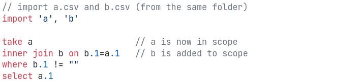
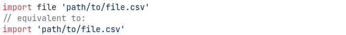
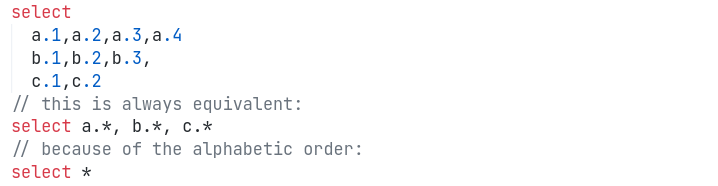
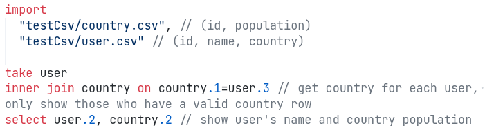
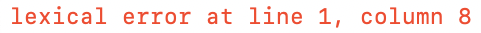

# JCQL - Just a CSV Query Language

## Introduction

Declarative programming language designed to work with CSV files. The syntax is designed to be SQL-like, but with some differences:

### Top to bottom scope evaluation

Unlike SQL, in JCQL you have to first import your files, then join, filter, and only then select the columns.

For example, the following SQL:

```sql
select a.1
from a
inner join b on b.1=a.1
where b.1 is not null
```

Would be written as:

{width=500}

This allows for a much more linear evaluation structure that is (in our opinion) much easier to follow. Just like in most general purpose languages, an identifier only comes into scope for expression below its declaration.

## Features

### Import

To use data stored in a comma separated values (csv) file, it first must be imported using the `import` command. 

```sql
import
	a 'A.csv'
	'B.csv'
```

The first imported file, A.csv, has been aliased and can now be referenced as 'a' in the rest of the program. The second imported file, B.csv, is unaliased so has to be referred as 'B' in the program. JCQL imports allow the use of both relative and absolute paths.

### Joins

JCQL allows for three types of joins.

```sql
cross join b
inner join b on a.1 = b.1
left join b on a.1 = b.1
```

- `cross join` is the cartesian product of the table defined after the take expression, with the table specified after cross join.
- `inner join` combines the table defined after the take expression, with the table specified after inner join, on the identified columns.
- `left join` returns all the data from the table defined after the take expression, with the matching data from the second table, on the identified columns.

### Select

A `select` statement allows the user to specify the variables or columns that will be outputted. This feature is the same as in SQL. 

```sql
select *
select a.1,0,a.2*10
```

- * on its own is a wildcard this returns all the columns of the table.
- `a.1` is column 1 from table a, this is how columns are represented in JCQL.
- Integer, boolean and string values are able to be returned.
- It is possible to select an expression, for example `a.2*10` multiplies the value in `a.2` by 10 and returns this value.

### Case

A `case` statement works the same as in SQL, by going through the conditions and returning the value after the then if the condition is met. If none of the conditions are satisfied then the returned value is the one in the `else` clause.

```sql
case when a.1 == 0 then 1
	 when a.1 != 0 then 2
	 else 0
```

### Order

JCQL allows the either lexical or default order, default ordering is the order that the data is in the csv file. Lexical ordering is also know as dictionary order, and orders the values depending on ASCii codes. If no `order` clause is present, default ordering is assumed.

```sql
order lexical
```

### Functions

- Coalesce
    - The `coalesce` function returns the first non null value in a column.
- Length
    - The `length` function returns the number of characters in a string.
- Nested
    - This allows subqueries to be nested inside other queries.

## Syntactic Features

### Automatically named imports & full paths

We don't have to specify the table name when file names are valid identifiers, however when an invalid filename is used (e.g. `b$d.csv`) you will see the error: `illegal characters used in the import`

{width=500}

Notice that we also allow to specify the full path to the file to be flexible to different scenarios.

### Select wildcard

If you want to select all values from a table (or all tables), you can use the `*` (aka "wildcard"):

{width=500}

### Comments & Whitespace

JCQL allows for using whitespace and comments, so that you can use it to write simple one liners as well as complex multi-line queries:

{width=500}

## Evaluation

As mentioned before, the evaluation is top to bottom.

### More Details

Every query starts off with an `import` statement. The imports can either be

## Informative Error Messages

All the errors are formatted before being output to `stderr`

### Lexer

{width=200}

Lexical error in JCQL

This error occurs when an unknown character such as £ is used in a program. This error informs the user where the unknown character is in the program, as seen in the error above.

### Parser

```sql
import a 'A.csv'
```

{width=200}

JCQL error for incomplete expression

A program just containing an `import` statement without a `take` clause would result in a incomplete expression error as both `import` and `take` clauses are mandatory.

```sql
import a 'A.csv'
take a v
```

{width=200}

JCQL error for unrecognised token

The above program would result in an unexpected token error. This error informs the user where the unexpected token is as seen in the error above.

### Interpreter

```haskell
data Result v =
  Ok v
  | Error String
  deriving (Eq, Show)

instance  Functor Result  where
  fmap _ (Error e) = Error e
  fmap f (Ok    a) = Ok (f a)

instance Applicative Result where
  pure v = Error ""

  Ok    f <*> m  = fmap f m
  Error s <*> _m = Error s

instance Monad Result where
  (Error s) >>= f = Error s
  (Ok    v) >>= f = f v
  return v = Ok v
```

1. Expressions errors (inside `where`, `select` and `inner/left join`)

    The error is being *built up* from bottom to the top. To explain this, here is an example:

    ```
    import
      test "test.csv"

    take test
    select case when test.1="O" then 'Frank' when test.2="O" then "Kyle" else 3 end
    ```

    ```
    Error in expression: case statement 'case when ((test.1 = 'O')) then ('Frank') when ((test.2 = 'O')) then ('Kyle') else (3) end': expected type 'string' in expression 3 but got 'integer'
    ```

    The error takes place when type checking the `else` statement and return an error displaying the expression. As we go up to the expression evaluator, we combine the error with the overall `case` statement and then finally this is output to `stderr`. Simil

2. Import errors
    - Error relating to missing files for imports:

        ```
        Import error: No such file or directory - <filename>.csv
        ```

    - Error relating to the illegal character used at implicit naming of the file:

        ```
        illegal characters used in the import
        ```

3. Invalid table reference error
    - When addressing a non-existing table in any part of the code:

        ```
        table '<tablename>' not found
        ```

    - Invalid column error

        ```
        could not find column <given_column> in table '<tablename>' (of length <actual_length>)
        ```

4. Invalid order request

    ```
    invalid order: '<given_order>'
    ```

## Type Checking

TODO: explain strict type checking (in select, filter, function args, and function outputs), show examples of different error messages

## Tooling

### Syntax Highlighting

We wrote a syntax highlighting plugin for VsCode that provides basic highlighting of keywords, strings, as well as numbers (for `.cql` files). All the screenshots you are seeing above are using the syntax highlighting plugin.

### REPL

We also added a simple REPL tool that allows programmers to experiment with queries without having to write them into a file:

{width=500}

