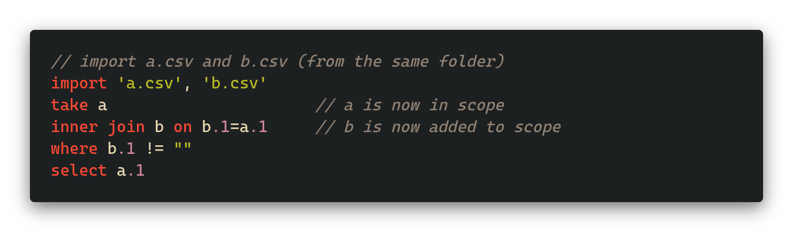
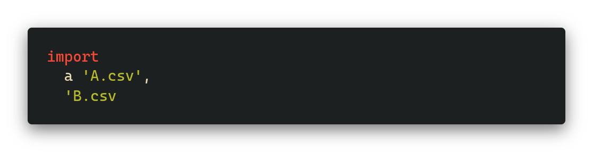
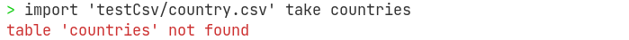
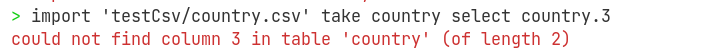
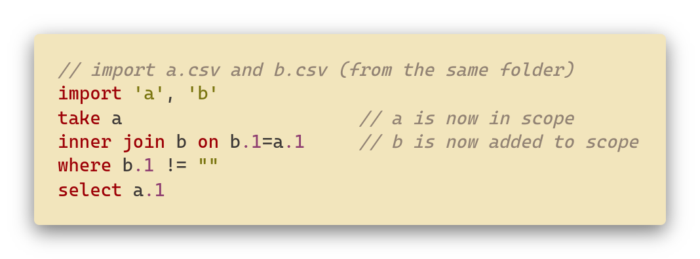

# JCQL - Just a CSV Query Language

## Introduction

Declarative programming language designed to work with CSV files. The syntax is designed to be SQL-like, but with some differences:

### Top to bottom scope evaluation

Unlike SQL, in JCQL you have to first import your files, then join, filter, and only then select the columns.

For example, the SQL in [Figure 1](#figure-1), would be written as the code in [Figure 2](#figure-2).

This allows for a much more linear evaluation structure that is (in our opinion) much easier to follow. Just like in most general purpose languages, an identifier only comes into scope for expression below its declaration.

## Features

### Import

To use data stored in a comma separated values (csv) file, it first must be imported using the `import` command. In [Figure 3](#figure-3), first imported file, A.csv, has been aliased and can now be referenced as 'a' in the rest of the program. The second imported file, B.csv, is unaliased so has to be referred as 'B' in the program. JCQL imports allow the use of both relative and absolute paths.

### Joins

JCQL allows for three types of joins which can be seen in [Figure 4](#figure-4).

- `cross join` is the cartesian product of the table defined after the take expression, with the table specified after cross join.
- `inner join` combines the table defined after the take expression, with the table specified after inner join, on the identified columns.
- `left join` returns all the data from the table defined after the take expression, with the matching data from the second table, on the identified columns.

### Select

A `select` statement allows the user to specify the variables or columns that will be outputted. This feature is the same as in SQL. Examples of select statements can be found in [Figure 5](#figure-5).

- on its own is a wildcard this returns all the columns of the table.
- `a.*` returns all the columns from table a.
- `a.1` is column 1 from table a, this is how columns are represented in JCQL.
- Integer, boolean and string values are able to be returned.
- It is possible to select an expression, for example `a.2*10` multiplies the value in `a.2` by 10 and returns this value.

### Case

A `case` statement works the same as in SQL, by going through the conditions and returning the value after the then if the condition is met. If none of the conditions are satisfied then the returned value is the one in the `else` clause. It is an expression that can be used in either `where` or `select` clauses. [Figure 6](#figure-6) contains an example case statement.

### Order

JCQL allows the either lexical or default order, default ordering is the order that the data is in the csv file. Lexical ordering is also known as dictionary order, and orders the values depending on ASCii codes. If no `order` clause is present, default ordering is assumed. [Figure 7](#figure-7) shows an example order clause.

### Functions

- Coalesce
  - The `coalesce` function returns the first non null value in a column.
- Length
  - The `length` function returns the number of characters in a string.
- Nested
  - This allows subqueries to be nested inside other queries.

## Syntactic Features

### Automatically named imports & full paths

We don't have to specify the table name when file names are valid identifiers, however when an invalid filename is used (e.g. `b$d.csv`) you will see the error: `illegal characters used in the import`

Notice that, in [Figure 8](#figure-8), we also allow to specify the full path to the file to be flexible to different scenarios.

### Select wildcard

If you want to select all values from a table (or all tables), you can use the `*` (aka "wildcard"), as shown in [Figure 9](#figure-9).

### Comments & Whitespace

JCQL allows for using whitespace and comments, so that you can use it to write simple one liners as well as complex multi-line queries, an example of this can be found in [Figure 10](#figure-10).

## Evaluation

As mentioned before, the evaluation is top to bottom. As the interpreter receives the parsed `AST`, first of all it opens all the relevant files and imports the relevant files. All of this is store is a map that is used throughout most of a program

From them on, the evaluation takes the same structure as a pipe in Shell. We can `take` a particular table, join it with the other table (that can be another nested `take` with joins) which would return a final joined table. This table can then be optionally passed to the `where` clause, that takes each row and evaluates it against a given expression (boolean that is type checked) and returns a newly filtered table.

We then get to the point of selection where all the select statements are converted to expressions (each expression must result in a String type) and is evaluated against each row resulting in yet another table. Finally, we can optionally pipe it to the `order` and resort all the rows.

Each pipe is a Haskell function that takes on a table from the previous pipe and additional arguments (usually an expression) which varies depending on the function, and reconstructs the table from it, which is then passed on to the next pipe. This structure ensures the further scalability of the language, where even more additional pipes can be defined that will tweak the final output to the more desired format.

## Error Messages and Type System

JCQL is a strongly typed dynamic language perfect for scripting small queries when dealing with csv files. There are 3 main types defined: `String`, `Boolean` and `Integers`.

- `String` is the default type for each table row value and is assumed for all tables and is expected in `select` statement
- `Integer` can be used in predicates (e.g. `where length(user.name) > 10`)
- `Boolean` is the most used type used extensively in `inner` and `left` joins, `where`, and `case`

All the errors are formatted before being output to `stderr` and explain the type issue thoroughly, as shown in [Figure 17](#figure-17).

### Lexer

This error, as seen in [Figure 11](#figure-11), occurs when an unknown character such as £ is used in a program. This error informs the user where the unknown character is in the program, as seen in the error above.

### Parser

A program just containing an `import` statement without a `take` clause would result in a incomplete expression error as both `import` and `take` clauses are mandatory. An example program where this error will occur and the error itself can be found in [Figure 13](#figure-13). 

The program in [Figure 14](#figure-14) would result in an unexpected token error, [Figure 15](#figure-15). This error informs the user where the unexpected token is as seen in the error above.

### Interpreter

1. Expressions errors (inside `where`, `select` and `inner/left join`)

   The error is being _built up_ from bottom to the top. An example of this error can be found in [Figure 16](#figure-16).

   The error takes place when type checking the `else` statement and return an error displaying the expression. As we go up to the expression evaluator, we combine the error with the overall `case` statement and then finally this is output to `stderr`. Simil

2. Import errors

   - Error relating to missing files for imports, [Figure 18](#figure-18).
   - Error relating to the illegal character used at implicit naming of the file, [Figure 19](#figure-19).

3. Invalid table reference error

   - When addressing a non-existing table in any part of the code, [Figure 20](#figure-20).
   - Invalid column error, [Figure 21](#figure-21).

4. Invalid order request, [Figure 22](#figure-22).

## Tooling

### Syntax Highlighting

We wrote a syntax highlighting plugin for VsCode that provides basic highlighting of keywords, strings, as well as numbers (for `.cql` files). All screenshots found in the appendix are using our theme, and the screenshot found in [Figure 23](#figure-23) shows an example of the syntax highlighting with a different theme.

### REPL

We also added a simple REPL tool that allows programmers to experiment with queries without having to write them into a file, see [Figure 24](#figure-24) for an example.

## Appendix

### Code

#### Figure 1
 SQL code:

{width=400}

#### Figure 2
 The equivalent JCQL code:

### Syntax Screenshots

#### Figure 3
 Example imports:

#### Figure 4
 Example joins:

#### Figure 5
 Example select clauses:

#### Figure 6
 Example case statement:

#### Figure 7
 Example order clause:

#### Figure 8
 Example imports:

#### Figure 9
 Example wildcard:

#### Figure 10
 Example comments and whitespace:

### Errors

#### Figure 11
 Lexical error:

{width=500}

#### Figure 13
 Incomplete expression:

{width=500}

#### Figure 14
 Example of invalid token:

#### Figure 15
 Invalid token:

{width=500}

#### Figure 16
 Haskell error handling:

#### Figure 17
 Type error with embedded expression:
 
Trying to select an integer:

Invalid function argument type:

#### Figure 18
 Error for missing file:

{width=500}

#### Figure 19
 Illegal character error:

{width=500}

#### Figure 20
 Non existing table error: 

{width=500}

#### Figure 21
 Invalid column error:

{width=500}

#### Figure 22
 Invalid order error:

{width=500}

### Additional tools

#### Figure 23
 Example highlighting:

#### Figure 24
 Example repl:

